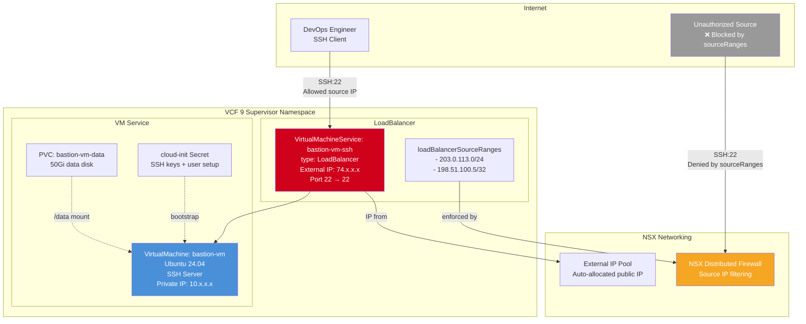

# Deploy Bastion VM — High-Level Design

## Overview

Deploy Bastion VM provisions a minimal Ubuntu 24.04 bastion host as a secure SSH jump server in a VCF 9 supervisor namespace. The VM is exposed via a VirtualMachineService LoadBalancer with `loadBalancerSourceRanges` to restrict SSH access to specific source IPs. This is the VCF equivalent of an AWS EC2 bastion instance with Security Groups.

Unlike all other deployment patterns, the bastion VM does not require a VKS cluster — it runs directly in the supervisor namespace.

## Architecture Diagram



## Component Details

### Bastion VM

| Attribute | Value | AWS Equivalent |
|---|---|---|
| Resource Type | VirtualMachine (VM Service) | EC2 Instance |
| OS | Ubuntu 24.04 Server | Amazon Linux 2023 |
| VM Class | best-effort-medium | t3.medium |
| Boot Disk | Default (OS) | Root EBS volume |
| Data Disk | 50Gi PVC mounted at /data | Additional EBS volume |
| Bootstrap | cloud-init (SSH keys, user creation) | EC2 User Data |
| Network | Private NSX SubnetSet | Private subnet |

### Access Control

| Mechanism | Details | AWS Equivalent |
|---|---|---|
| VirtualMachineService | LoadBalancer with port 22 exposed | Network Load Balancer |
| loadBalancerSourceRanges | Restricts SSH to specific source CIDRs | Security Group inbound rules |
| NSX Distributed Firewall | Enforces source IP filtering at the network level | VPC Security Groups |
| SSH Key Authentication | Ed25519 key injected via cloud-init | EC2 Key Pair |

### cloud-init Configuration

```yaml
users:
  - name: rackadmin
    groups: sudo
    shell: /bin/bash
    sudo: ALL=(ALL) NOPASSWD:ALL
    ssh_authorized_keys:
      - ssh-ed25519 AAAA... (your public key)
```

## Key Design Decisions

1. **No VKS cluster required** — The bastion VM runs directly in the supervisor namespace using VM Service. This makes it available even before a VKS cluster is provisioned, useful for debugging network connectivity.

2. **Source IP restriction** — The `loadBalancerSourceRanges` field on the VirtualMachineService restricts SSH access to specific source CIDRs. NSX enforces this at the distributed firewall level, equivalent to AWS Security Groups.

3. **Data disk persistence** — A separate 50Gi PVC is attached as a data disk. This survives VM recreation and can store SSH session logs, scripts, or temporary files.

4. **Minimal footprint** — The bastion VM is intentionally minimal — just SSH access with sudo. No application software is installed. It serves as a jump host for accessing other resources in the VCF environment.
