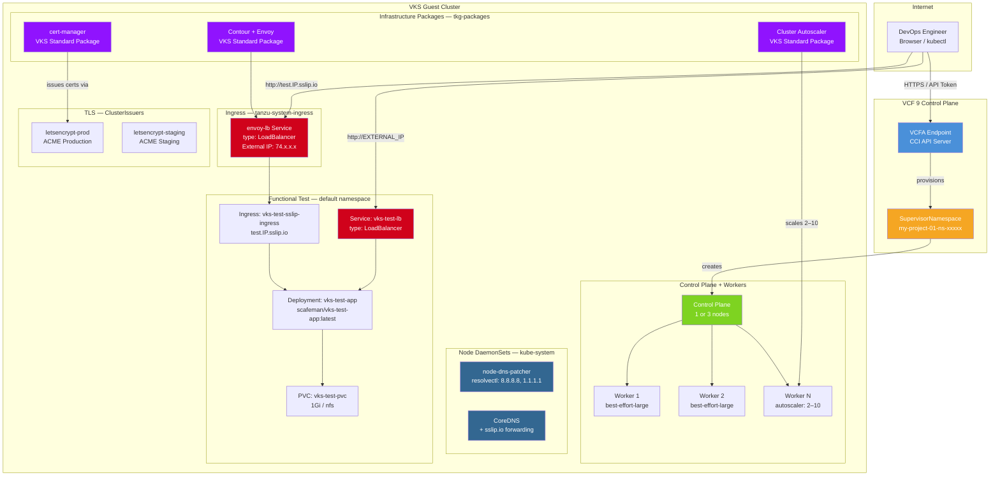

# Deploy Cluster — High-Level Design

## Overview

Deploy Cluster provisions a production-ready VKS (vSphere Kubernetes Service) cluster from scratch on VCF 9 private cloud infrastructure. It is the foundation for all other deployment patterns — every container-based pattern depends on a running VKS cluster created by this workflow.

This is the VCF equivalent of creating an AWS EKS cluster with managed node groups, EBS CSI driver, ALB controller, and cluster autoscaler.

## Architecture Diagram

## Component Details

### VCF Control Plane

| Component | Purpose | AWS Equivalent |
|---|---|---|
| VCFA Endpoint | API gateway for all VCF operations | AWS API Gateway / EKS API |
| CCI (Cloud Consumption Interface) | Project, Namespace, and RBAC management | IAM + Organizations |
| Project | Governance boundary for resources | AWS Account / OU |
| SupervisorNamespace | Resource-scoped Kubernetes namespace with compute/storage/network quotas | EKS Namespace + Resource Quotas |
| ProjectRoleBinding | RBAC grant (admin, edit, view) | IAM Role Binding |

### VKS Cluster

| Component | Purpose | Configuration |
|---|---|---|
| Control Plane | Kubernetes API server, etcd, scheduler, controller-manager | 1 node (dev) or 3 nodes (HA) |
| Worker Pool | Application workload nodes | best-effort-large VMs, autoscaler 2–10 |
| Cluster Autoscaler | Automatic node scaling based on pod resource demands | VKS Standard Package |
| CoreDNS | Cluster DNS with sslip.io forwarding rule | Forwards `sslip.io` queries to 8.8.8.8, 1.1.1.1 |

### Infrastructure Packages (tkg-packages)

| Package | Purpose | AWS Equivalent |
|---|---|---|
| cert-manager | X.509 certificate lifecycle management | ACM (AWS Certificate Manager) |
| Contour | Envoy-based ingress controller | ALB Ingress Controller |
| Cluster Autoscaler | Node pool auto-scaling | EKS Managed Node Group autoscaling |

### Networking

| Component | Purpose | Details |
|---|---|---|
| NSX VPC | Network isolation boundary | Private CIDR 10.10.0.0/16 |
| Transit Gateway | North-South routing between VPC and external networks | Connects VPC to physical network |
| External IP Pool | Public IPs for LoadBalancer services | Auto-allocated by NSX |
| envoy-lb | Shared Contour ingress LoadBalancer | Single public IP for all Ingress routes |
| sslip.io | Magic DNS — resolves `*.IP.sslip.io` to IP | No DNS provider needed |

### TLS / Certificate Management

| Component | Purpose | Details |
|---|---|---|
| cert-manager | Watches Ingress annotations, requests certificates from ACME | VKS Standard Package |
| ClusterIssuer (prod) | Let's Encrypt production endpoint | Trusted certificates, rate-limited |
| ClusterIssuer (staging) | Let's Encrypt staging endpoint | Untrusted certificates, no rate limit |
| HTTP-01 Challenge | Domain validation via HTTP | Requires port 80 accessible from internet |
| CoreDNS sslip.io rule | Forwards sslip.io queries to public DNS | Required for cert-manager self-checks |

## Provisioning Phases

| Phase | What Happens | Duration |
|---|---|---|
| 1. Context Creation | VCF CLI authenticates to VCFA | ~5s |
| 2. Project & Namespace | Creates Project, RBAC, SupervisorNamespace | ~10s |
| 3. Context Bridge | Switches to namespace-scoped context | ~30s |
| 4. VKS Cluster | Applies Cluster API manifest, waits for Provisioned | ~8–12 min |
| 5. Kubeconfig | Retrieves admin kubeconfig, verifies API access | ~30s |
| 5a. Package Repo | Registers VKS standard package repository | ~30s |
| 5b. Cluster Autoscaler | Installs and configures autoscaler package | ~60s |
| 5g. cert-manager | Installs cert-manager VKS package | ~60s |
| 5h. Contour + envoy-lb | Installs Contour, creates envoy-lb LoadBalancer, patches CoreDNS | ~90s |
| 5i. ClusterIssuers | Creates Let's Encrypt prod + staging ClusterIssuers | ~30s |
| 5j. Node DNS Patcher | Deploys DaemonSet to configure systemd-resolved with public DNS on each node | ~15s |
| 6. Functional Test | Deploys test app, verifies PVC + LB + HTTP + sslip.io | ~60s |

**Total: ~12–18 minutes** from zero to a fully validated VKS cluster.

## Key Design Decisions

1. **Single envoy-lb for all patterns** — All deployment patterns share one Contour envoy-lb LoadBalancer IP. Each pattern creates its own Ingress with a unique sslip.io hostname. This avoids wasting public IPs.

2. **CoreDNS sslip.io forwarding** — cert-manager's HTTP-01 solver needs to resolve sslip.io hostnames from inside the cluster. The CoreDNS forwarding rule sends `sslip.io` queries to 8.8.8.8 and 1.1.1.1 instead of the cluster's internal DNS.

3. **Dual access for functional test** — deploy-cluster keeps both the raw LoadBalancer IP (for NSX validation) and the envoy-lb Ingress (for sslip.io). Other patterns use only the envoy-lb Ingress.

4. **Idempotent provisioning** — Every phase checks if resources already exist before creating them. The script can be re-run safely after partial failures.

5. **Node DNS Patcher DaemonSet** — VKS nodes inherit corporate DNS from the Supervisor Cluster, which can't resolve sslip.io. The `node-dns-patcher` DaemonSet uses `nsenter` + `resolvectl` to add public DNS servers (8.8.8.8, 1.1.1.1) to `systemd-resolved` on each node, enabling kubelet/containerd to resolve sslip.io hostnames for container image pulls.
