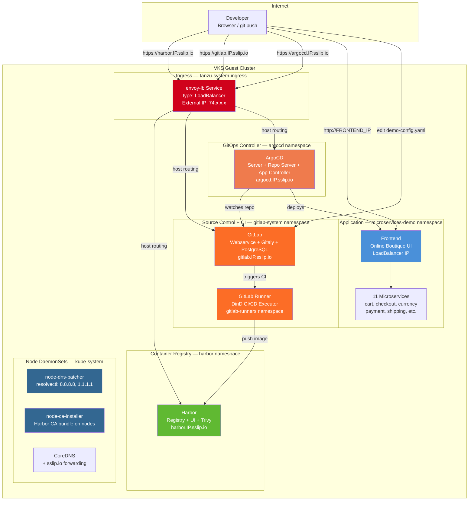

# Deploy GitOps — High-Level Design

## Overview

Deploy GitOps installs a self-contained CI/CD and GitOps stack on an existing VKS cluster: Harbor (container registry), GitLab (source control + CI), ArgoCD (GitOps continuous delivery), and a sample application (Google Microservices Demo / Online Boutique). This demonstrates that VCF can deliver the same developer experience as AWS ECR + CodePipeline + ArgoCD.

When sslip.io DNS is enabled, all services are accessible via `*.IP.sslip.io` hostnames with dynamic self-signed TLS certificates generated for the sslip.io domain.

## Architecture Diagram



## Component Details

### CI/CD Stack

| Component | Role | AWS Equivalent | Namespace |
|---|---|---|---|
| Harbor | Container registry + vulnerability scanning | ECR + Inspector | harbor |
| GitLab | Source control + CI pipelines | CodeCommit + CodeBuild | gitlab-system |
| GitLab Runner | CI/CD job executor | CodeBuild compute | gitlab-runners |
| ArgoCD | GitOps continuous delivery | CodePipeline + Flux | argocd |
| Online Boutique | Sample microservices application | Demo workload | microservices-demo |

### Networking

| Service | Hostname (sslip.io mode) | Access Method |
|---|---|---|
| Harbor | `harbor.IP.sslip.io` | Contour Ingress via envoy-lb |
| GitLab | `gitlab.IP.sslip.io` | Contour Ingress via envoy-lb |
| ArgoCD | `argocd.IP.sslip.io` | Contour Ingress via envoy-lb |
| Online Boutique | Direct LoadBalancer IP | frontend-external Service |

### TLS Strategy (sslip.io Mode)

| Aspect | Details |
|---|---|
| DOMAIN override | `DOMAIN` is set to `IP.sslip.io` after envoy-lb IP is known |
| Wildcard cert | Dynamic self-signed cert generated for `*.IP.sslip.io` |
| Why self-signed? | Helm charts (Harbor, GitLab) require TLS secrets for internal communication |
| CoreDNS | Skipped — sslip.io resolves externally |
| Let's Encrypt | Not used for GitOps (Helm charts manage their own TLS) |

## GitOps Workflow

```
Developer → git push → GitLab → GitLab Runner (CI) → Harbor (image push)
                                                           ↓
                        ArgoCD ← watches git repo ← GitLab (manifests)
                           ↓
                    Deploys to microservices-demo namespace
```

## CI/CD Pipeline Flow

After initial deployment, the ArgoCD Application is re-pointed from GitHub to a GitLab project containing the microservices-demo Kustomize overlay and a `.gitlab-ci.yml` pipeline. This enables a self-contained CI/CD loop:

```
Edit demo-config.yaml in GitLab web UI
  → GitLab CI triggers (build + update-manifests stages)
    → Docker-in-Docker builds customized frontend image
      → Image pushed to Harbor (microservices-ci project)
        → kustomization.yaml image tag updated with commit SHA
          → ArgoCD detects kustomization.yaml change and syncs
            → New frontend pod deployed with custom banner message
```

The pipeline files pushed to the GitLab project:

| File | Purpose |
|---|---|
| `kustomization.yaml` | Kustomize overlay with `images` section referencing Harbor CI |
| `kubernetes-manifests.yaml` | Upstream microservices-demo manifests |
| `.gitlab-ci.yml` | Two-stage pipeline: `build` (DinD) and `update-manifests` |
| `Dockerfile` | Extends upstream frontend with configurable `FRONTEND_MESSAGE` |
| `demo-config.yaml` | Banner configuration — edit this file to trigger the pipeline |

## Installation Order

| Phase | Component | Method | Duration |
|---|---|---|---|
| 1 | Kubeconfig setup | VCF CLI | ~10s |
| 2 | Self-signed certs | openssl (dynamic `*.IP.sslip.io`) | ~5s |
| 3 | Package namespace + repo | VKS CLI | ~30s |
| 3c | cert-manager | VKS Standard Package | ~60s |
| 3d | Contour + envoy-lb | VKS Standard Package | ~90s |
| 4 | Harbor | Helm chart | ~3 min |
| 5 | CoreDNS | Skipped (sslip.io mode) | 0s |
| 6 | ArgoCD | Helm chart | ~2 min |
| 7 | GitLab | Helm chart (operator) | ~5 min |
| 8 | GitLab Runner | Helm chart | ~1 min |
| 9 | ArgoCD Application | kubectl apply | ~3 min |
| 16 | Harbor CI Project + GitLab Project | REST API + git push | ~30s |
| 17 | ArgoCD Re-Point to GitLab | argocd CLI + kubectl patch | ~1 min |
| 18 | Pipeline Verification | REST API + kubectl | ~15s |

**Total: ~20–25 minutes**

## Key Design Decisions

1. **Self-contained stack** — Harbor, GitLab, and ArgoCD all run inside the VKS cluster. No external dependencies on SaaS services. This proves VCF can deliver a complete developer platform on private infrastructure.

2. **Dynamic sslip.io certs** — When `USE_SSLIP_DNS=true`, the DOMAIN is overridden to `IP.sslip.io` and a new wildcard cert is generated for `*.IP.sslip.io`. This is needed because Helm charts (Harbor, GitLab) require TLS secrets for internal pod-to-pod communication.

3. **Shared infrastructure packages** — cert-manager and Contour are installed as VKS Standard Packages shared with other deployment patterns. The GitOps stack reuses the same envoy-lb LoadBalancer.

4. **ArgoCD Application CR** — The Online Boutique is deployed declaratively via an ArgoCD Application custom resource that watches a Git repository. This demonstrates the GitOps reconciliation loop.

5. **CI/CD pipeline** — After initial deployment from GitHub, the ArgoCD Application is re-pointed to a GitLab project. Editing `demo-config.yaml` in GitLab triggers a CI pipeline that builds a customized frontend image, pushes it to Harbor, and updates the `kustomization.yaml` image tag. ArgoCD detects the change and syncs the new image to the cluster.
