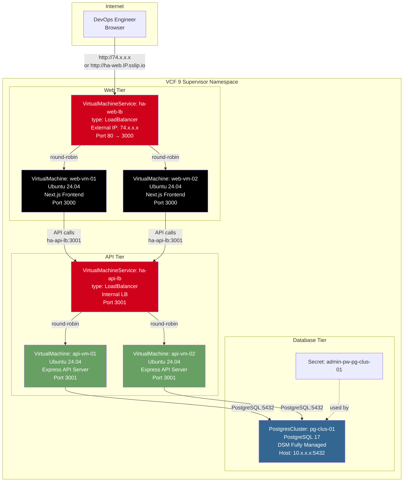

# Deploy HA VM App — High-Level Design

## Overview

Deploy HA VM App provisions a traditional high-availability three-tier application entirely on VCF VM Service VMs — no containers involved. Two web-tier VMs run Next.js behind a VirtualMachineService LoadBalancer, two API-tier VMs run Express behind another LoadBalancer, and a DSM-managed PostgresCluster provides the database tier.

This is the VCF equivalent of deploying a classic HA application on AWS with 2× EC2 (web) + ALB + 2× EC2 (API) + ALB + RDS PostgreSQL Multi-AZ.

## Architecture Diagram

## Component Details

### Web Tier (2× VMs + LoadBalancer)

| Attribute | Value | AWS Equivalent |
|---|---|---|
| VMs | web-vm-01, web-vm-02 | 2× EC2 instances |
| OS | Ubuntu 24.04 Server | Amazon Linux 2023 |
| Application | Next.js Frontend (port 3000) | Node.js on EC2 |
| LoadBalancer | VirtualMachineService (ha-web-lb) | Application Load Balancer |
| External IP | Auto-allocated from NSX External IP Pool | Elastic IP / ALB DNS |
| Bootstrap | cloud-init: apt install, npm install, pm2 start | EC2 User Data |
| sslip.io | DNS alias only (`ha-web.IP.sslip.io`) | Route 53 alias |

### API Tier (2× VMs + LoadBalancer)

| Attribute | Value | AWS Equivalent |
|---|---|---|
| VMs | api-vm-01, api-vm-02 | 2× EC2 instances |
| OS | Ubuntu 24.04 Server | Amazon Linux 2023 |
| Application | Express API Server (port 3001) | Node.js on EC2 |
| LoadBalancer | VirtualMachineService (ha-api-lb) | Internal ALB |
| Network | Internal only (no external IP) | Private subnet ALB |
| Bootstrap | cloud-init: apt install, npm install, pm2 start | EC2 User Data |

### Database Tier (DSM Managed)

| Attribute | Value | AWS Equivalent |
|---|---|---|
| Resource | PostgresCluster (DSM CRD) | RDS PostgreSQL |
| Version | PostgreSQL 17 | RDS engine version |
| Management | Fully managed by DSM | Fully managed by RDS |
| Connection | Internal IP:5432 | RDS endpoint |

### Networking

| Path | Protocol | Details |
|---|---|---|
| User → Web LB | HTTP:80 | External LoadBalancer (public IP) |
| Web VMs → API LB | HTTP:3001 | Internal LoadBalancer (private IP) |
| API VMs → PostgreSQL | TCP:5432 | Direct connection over NSX VPC |
| sslip.io | DNS alias | `ha-web.IP.sslip.io` → Web LB IP (no Ingress/TLS) |

## Key Design Decisions

1. **No Kubernetes Ingress** — VM-based LoadBalancers (VirtualMachineService) operate at the supervisor level, not inside a VKS cluster. They don't support Kubernetes Ingress resources. sslip.io provides a DNS alias only.

2. **cloud-init for everything** — All 4 VMs are fully configured at boot time via cloud-init secrets. No SSH required after provisioning. The cloud-init scripts install Node.js, clone the application code, install dependencies, and start the application via pm2.

3. **DSM for database** — The database tier uses DSM-managed PostgreSQL (same as Deploy Managed DB App) rather than a manually provisioned PostgreSQL VM. This demonstrates that VM-based applications can also benefit from managed database services.

4. **Internal API LoadBalancer** — The API tier LoadBalancer has no external IP. Web VMs connect to it via the internal service name (`ha-api-lb`), keeping the API tier private.

5. **No VKS cluster required** — This pattern runs entirely in the supervisor namespace. It demonstrates that VCF can host traditional VM-based applications alongside containerized workloads.
