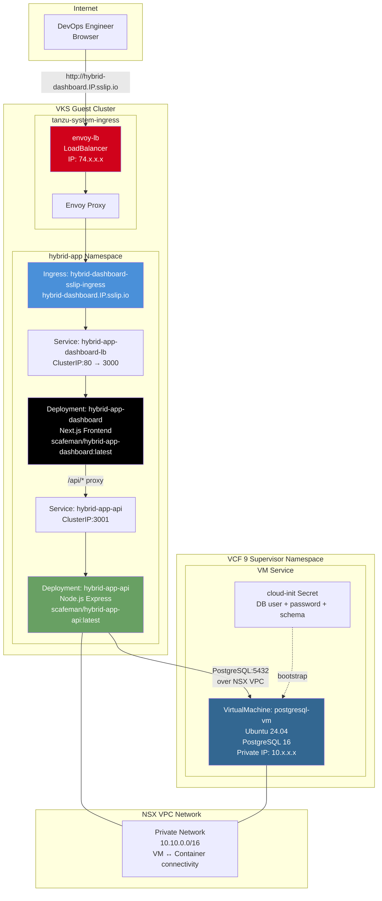

# Deploy Hybrid App — High-Level Design

## Overview

Deploy Hybrid App demonstrates VM-to-container connectivity within a VCF 9 namespace. A PostgreSQL 16 database runs on a dedicated VM provisioned via VCF VM Service, while a Node.js REST API and Next.js frontend run as containerized workloads in the VKS guest cluster. Both tiers communicate over the NSX VPC private network.

This is the VCF equivalent of running an EC2 database instance alongside EKS containers in the same AWS VPC.

## Architecture Diagram

## Component Details

### Data Tier — PostgreSQL VM

| Attribute | Value |
|---|---|
| Resource Type | VirtualMachine (VM Service) |
| OS | Ubuntu 24.04 Server |
| Database | PostgreSQL 16 |
| VM Class | best-effort-medium |
| Network | Private NSX SubnetSet (no public IP) |
| Bootstrap | cloud-init Secret with DB user/password/schema creation |
| Storage | Boot disk (default) |

### Application Tier — Node.js API

| Attribute | Value |
|---|---|
| Resource Type | Kubernetes Deployment |
| Image | `scafeman/hybrid-app-api:latest` |
| Port | 3001 |
| Service Type | ClusterIP |
| DB Connection | Direct TCP to VM private IP:5432 over NSX VPC |
| Health Check | `GET /healthz` |

### Presentation Tier — Next.js Dashboard

| Attribute | Value |
|---|---|
| Resource Type | Kubernetes Deployment |
| Image | `scafeman/hybrid-app-dashboard:latest` |
| Port | 3000 |
| Service Type | ClusterIP (sslip.io mode) / LoadBalancer (legacy) |
| Ingress | `hybrid-dashboard.IP.sslip.io` via shared envoy-lb |
| API Proxy | Next.js rewrites `/api/*` to `hybrid-app-api:3001` |

### Networking

| Path | Protocol | Details |
|---|---|---|
| User → Dashboard | HTTP/HTTPS | Via sslip.io Ingress on envoy-lb |
| Dashboard → API | HTTP | ClusterIP service within cluster |
| API → PostgreSQL VM | TCP:5432 | Over NSX VPC private network (cross-tier) |

## Key Design Decisions

1. **VM-to-container connectivity** — The PostgreSQL VM and VKS worker nodes share the same NSX VPC, enabling direct TCP communication without NAT or VPN. This is the same pattern as EC2 + EKS in the same AWS VPC.

2. **cloud-init bootstrap** — The VM is fully configured at boot time via cloud-init: PostgreSQL installation, `pg_hba.conf` configuration for remote access, user/database creation. No SSH required after provisioning.

3. **ClusterIP + sslip.io Ingress** — When `USE_SSLIP_DNS=true`, the dashboard uses ClusterIP and routes through the shared envoy-lb Ingress. No additional public IP is consumed.

4. **Separate VM lifecycle** — The PostgreSQL VM is provisioned in the supervisor namespace (not the guest cluster). It persists independently of the VKS cluster and can be managed via `kubectl get virtualmachine`.
