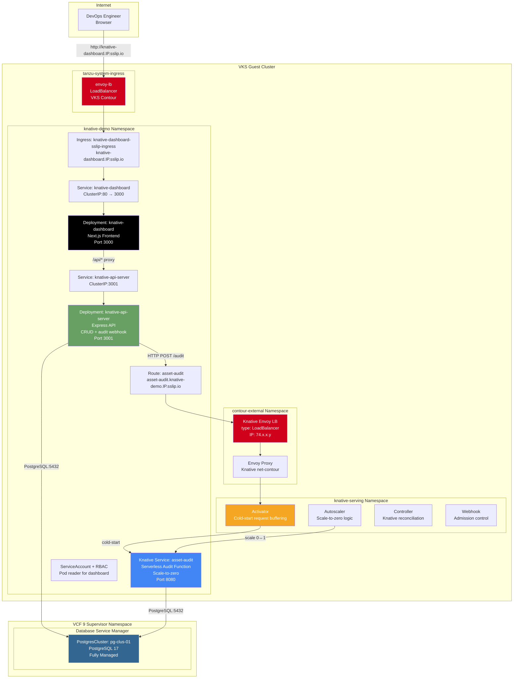

# Deploy Knative — High-Level Design

## Overview

Deploy Knative installs Knative Serving on an existing VKS cluster and deploys a serverless asset tracker application with scale-to-zero capabilities. An Express API server handles CRUD operations, a Knative Service audit function logs asset changes (scaling to zero when idle), and a DSM-managed PostgresCluster provides persistent storage. A Next.js dashboard provides the UI.

This is the VCF equivalent of AWS Lambda + API Gateway + RDS — serverless functions with persistent database storage on private cloud infrastructure.

## Architecture Diagram



## Component Details

### Knative Serving Infrastructure

| Component | Namespace | Purpose | AWS Equivalent |
|---|---|---|---|
| Knative Controller | knative-serving | Reconciles Knative Service CRs | Lambda control plane |
| Knative Autoscaler | knative-serving | Scale-to-zero and scale-from-zero logic | Lambda concurrency scaling |
| Knative Activator | knative-serving | Buffers requests during cold-start | Lambda cold-start handler |
| net-contour | knative-serving | Knative networking layer (Envoy-based) | API Gateway |
| Contour (external) | contour-external | Envoy proxy for Knative Service routing | API Gateway HTTP proxy |

### Application Components

| Component | Type | Image | Port | Details |
|---|---|---|---|---|
| API Server | Deployment | `scafeman/knative-api:latest` | 3001 | CRUD operations + audit webhook |
| Audit Function | Knative Service | `scafeman/knative-audit:latest` | 8080 | Scale-to-zero, logs asset changes |
| Dashboard | Deployment | `scafeman/knative-dashboard:latest` | 3000 | Next.js UI with pod status |
| PostgresCluster | DSM CRD | PostgreSQL 17 | 5432 | Shared by API + Audit |

### Scale-to-Zero Behavior

```
Idle state (0 pods):
    Request arrives → Knative Activator buffers request
                    → Autoscaler scales audit function 0→1
                    → Pod starts (cold-start: ~3-5 seconds)
                    → Activator forwards buffered request
                    → Response returned to caller

After grace period (default 30s of no traffic):
    Autoscaler scales audit function 1→0
    → Pod terminated
    → Zero resource consumption
```

### Dual Envoy Architecture

| Envoy Instance | Namespace | Purpose | LoadBalancer |
|---|---|---|---|
| VKS Contour envoy-lb | tanzu-system-ingress | Dashboard + other pattern Ingress routing | Shared across all patterns |
| Knative net-contour Envoy | contour-external | Knative Service routing (`*.knative-demo.IP.sslip.io`) | Separate LB (Knative-managed) |

### DNS Routing

| Hostname | Routes To | Via |
|---|---|---|
| `knative-dashboard.IP.sslip.io` | Dashboard (Next.js) | VKS envoy-lb Ingress |
| `asset-audit.knative-demo.IP.sslip.io` | Audit function (Knative Service) | Knative Envoy LB |
| `*.knative-demo.IP.sslip.io` | Knative Services | Knative Envoy LB |

## Key Design Decisions

1. **Separate Envoy for Knative** — Knative's net-contour creates its own Envoy proxy and LoadBalancer in `contour-external`. This is separate from the VKS Contour envoy-lb used by other patterns. Both must coexist.

2. **Dashboard uses VKS Ingress, not Knative** — The dashboard is a regular Deployment (not a Knative Service) because it needs to be always-on. It routes through the shared VKS envoy-lb Ingress, not the Knative Envoy.

3. **HTTP webhook for audit** — The API server calls the audit function via a direct HTTP POST to the Knative Service URL. This is simpler than event-driven architectures (like CloudEvents) and demonstrates the basic FaaS invocation pattern.

4. **Shared DSM PostgreSQL** — Both the API server and the audit function connect to the same DSM-managed PostgresCluster. The audit function writes to an `audit_log` table while the API server manages the `assets` table.

5. **RBAC for dashboard** — The dashboard pod has a ServiceAccount with a Role that allows reading pod status in the `knative-demo` namespace. This enables the dashboard to show real-time pod counts (demonstrating scale-to-zero visually).
