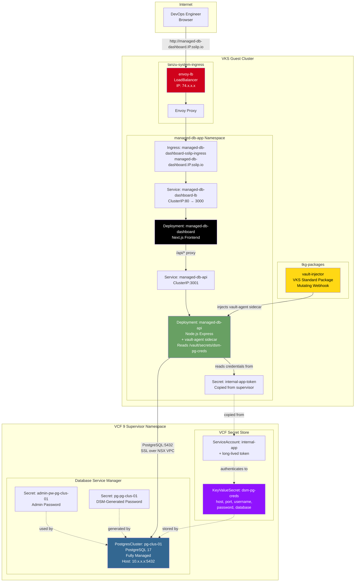

# Deploy Managed DB App — High-Level Design

## Overview

Deploy Managed DB App provisions a fully managed PostgreSQL database via VCF Database Service Manager (DSM) and deploys a Next.js/Node.js application that connects to it using vault-injected credentials. This is the VCF equivalent of AWS EKS + RDS + Secrets Manager — a fully managed database with zero-trust credential management.

This is the deployment pattern that resonates most with teams migrating from AWS. If you're running EKS + RDS today, this proves VCF can deliver the same pattern on private cloud infrastructure.

## Architecture Diagram



## Component Details

### Data Tier — DSM PostgresCluster

| Attribute | Value | AWS Equivalent |
|---|---|---|
| Resource Type | PostgresCluster (DSM CRD) | RDS PostgreSQL |
| Version | PostgreSQL 17 | RDS engine version |
| Topology | Single Server (replicas: 0) or HA (replicas: 1) | Single-AZ / Multi-AZ |
| VM Class | best-effort-large (4 CPU min) | db.m5.large |
| Storage | NFS storage policy | gp3 EBS |
| Maintenance | Configurable window (day, time, duration) | RDS maintenance window |
| Connection | `host:port/dbname` via status.connection | RDS endpoint |
| Admin Password | Kubernetes Secret (user-provided) | RDS master password |

### Credential Flow — Zero-Trust Secret Injection

```
1. DSM provisions PostgresCluster → generates pg-pg-clus-01 Secret
2. Script creates KeyValueSecret (dsm-pg-creds) in VCF Secret Store
3. Script creates ServiceAccount (internal-app) + long-lived token in supervisor
4. Token is copied into guest cluster namespace (internal-app-token)
5. vault-injector webhook intercepts API pod creation
6. vault-agent sidecar is injected → reads dsm-pg-creds from Secret Store
7. Credentials appear at /vault/secrets/dsm-pg-creds inside the API container
8. API reads credentials from file → connects to DSM PostgreSQL over SSL
```

### vault-injector Integration

| Component | Details |
|---|---|
| Package | vault-injector VKS Standard Package (v1.6.2) |
| Mechanism | Mutating admission webhook intercepts pod creation |
| Sidecar | vault-agent container injected into pods with vault annotations |
| Credential Path | `/vault/secrets/dsm-pg-creds` (mounted as file) |
| Authentication | ServiceAccount token (internal-app-token) |
| Webhook Wait | Script waits up to 120s for `mutatingwebhookconfiguration vault-agent-injector-cfg` |
| Sleep Buffer | 5-second pause after webhook registration before pod creation |
| CrashLoopBackOff | Auto-restart via `kubectl rollout restart` if sidecar injection fails |

### Application Tier

| Component | Image | Port | Service Type |
|---|---|---|---|
| API Server | `scafeman/hybrid-app-api:latest` | 3001 | ClusterIP |
| Dashboard | `scafeman/hybrid-app-dashboard:latest` | 3000 | ClusterIP (sslip.io) / LB (legacy) |

## Key Design Decisions

1. **DSM over manual VM** — Unlike Deploy Hybrid App which provisions a PostgreSQL VM manually, this pattern uses DSM for fully managed database lifecycle. DSM handles VM provisioning, PostgreSQL installation, patching, maintenance windows, and connection endpoint management.

2. **vault-injected credentials** — Credentials are never stored in environment variables or ConfigMaps. The vault-agent sidecar reads them from the VCF Secret Store at runtime and writes them to a file inside the pod. This is the same zero-trust pattern as AWS IRSA + Secrets Manager.

3. **Webhook readiness guard** — The vault-injector webhook must be registered before creating pods with vault annotations. The script waits for the `mutatingwebhookconfiguration` to exist, then sleeps 5 seconds to ensure the webhook is fully ready. If the pod still enters CrashLoopBackOff, the deployment is automatically restarted.

4. **Shared vault-injector** — The vault-injector package is shared between Deploy Managed DB App and Deploy Secrets Demo. Neither teardown script deletes it — only the other pattern's teardown can remove it.
