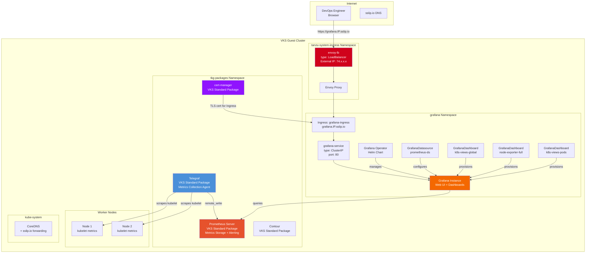

# Deploy Metrics — High-Level Design

## Overview

Deploy Metrics installs a full observability stack on an existing VKS cluster: Telegraf for metrics collection, Prometheus for metrics storage and alerting, and Grafana for visualization dashboards. All components are installed as VKS Standard Packages (Telegraf, Prometheus) or via Helm (Grafana Operator).

This is the VCF equivalent of AWS CloudWatch + Managed Grafana, running entirely on private cloud infrastructure.

## Architecture Diagram



## Component Details

### Metrics Pipeline

| Component | Role | AWS Equivalent | Details |
|---|---|---|---|
| Telegraf | Metrics collection agent | CloudWatch Agent | Scrapes kubelet metrics from every node, forwards to Prometheus |
| Prometheus | Metrics storage + alerting | CloudWatch Metrics | Time-series database with PromQL query language |
| Grafana Operator | Manages Grafana lifecycle | Managed Grafana control plane | Helm-installed operator that reconciles Grafana CRs |
| Grafana | Visualization dashboards | Managed Grafana | Web UI with pre-configured Kubernetes dashboards |

### Pre-Configured Dashboards

| Dashboard | What It Shows |
|---|---|
| k8s-views-global | Cluster-wide resource utilization (CPU, memory, pods) |
| node-exporter-full | Per-node hardware and OS metrics |
| k8s-views-pods | Per-pod resource consumption and status |

### Networking (sslip.io Mode)

| Component | Details |
|---|---|
| Grafana Service | ClusterIP (no public IP wasted) |
| Grafana Ingress | `grafana.IP.sslip.io` via shared envoy-lb |
| TLS | cert-manager annotation for Let's Encrypt (when ClusterIssuer is ready) |
| CoreDNS | Skips patching — sslip.io resolves externally |
| Self-signed certs | Skipped entirely when USE_SSLIP_DNS=true |

### Networking (Legacy Mode — USE_SSLIP_DNS=false)

| Component | Details |
|---|---|
| Grafana Service | ClusterIP behind Contour Ingress |
| Grafana Ingress | `grafana.lab.local` with self-signed TLS |
| CoreDNS | Patched with static host entry for `grafana.lab.local` |
| Self-signed certs | Generated wildcard cert for `*.lab.local` |

## Data Flow

```
Node kubelet → Telegraf (scrape) → Prometheus (store) → Grafana (query + visualize)
                                                              ↑
                                                    DevOps Engineer (browser)
                                                    via grafana.IP.sslip.io
```

## Package Installation Order

| Order | Package | Namespace | Install Method |
|---|---|---|---|
| 1 | Package Repository | tkg-packages | `vcf package repository add` |
| 2 | cert-manager | tkg-packages | `vcf package install` |
| 3 | Contour | tkg-packages | `vcf package install` |
| 4 | Telegraf | tkg-packages | `vcf package install` with custom values |
| 5 | Prometheus | tkg-packages | `vcf package install` with custom values |
| 6 | Grafana Operator | grafana | `helm upgrade --install` |
| 7 | Grafana Instance | grafana | `kubectl apply` (Grafana CR) |

## Key Design Decisions

1. **VKS Standard Packages for core components** — Telegraf, Prometheus, cert-manager, and Contour are installed as VKS Standard Packages managed by kapp-controller. This ensures version compatibility and lifecycle management.

2. **Helm for Grafana** — The Grafana Operator is not available as a VKS Standard Package, so it's installed via Helm. The operator pattern allows declarative management of Grafana instances, datasources, and dashboards via CRDs.

3. **Shared envoy-lb** — Grafana uses the same envoy-lb LoadBalancer created by deploy-cluster. No additional public IP is consumed.

4. **Teardown strips finalizers** — kapp-controller's reconcile-delete can cascade into deleting shared namespaces. The teardown script strips finalizers from PackageInstall and App resources before deletion to prevent this.
