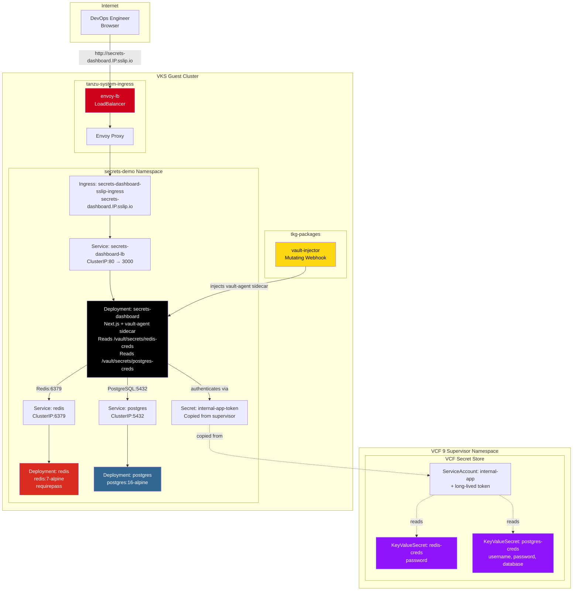

# Deploy Secrets Demo — High-Level Design

## Overview

Deploy Secrets Demo demonstrates VCF Secret Store integration with vault-injected secrets for Redis and PostgreSQL. A Next.js dashboard reads vault-injected credentials at runtime to verify connectivity to both data stores. This proves that VCF can deliver the same zero-trust credential management as AWS Secrets Manager + EKS.

Unlike Deploy Managed DB App (which uses DSM-managed PostgreSQL), this pattern deploys Redis and PostgreSQL as simple in-cluster containers to focus on the secret injection workflow.

## Architecture Diagram



## Component Details

### Secret Store Integration

| Resource | Type | Contents | Stored In |
|---|---|---|---|
| redis-creds | KeyValueSecret | `password` | VCF Secret Store (supervisor) |
| postgres-creds | KeyValueSecret | `username`, `password`, `database` | VCF Secret Store (supervisor) |
| internal-app | ServiceAccount | Long-lived token for vault authentication | Supervisor namespace |
| internal-app-token | Secret | Token + CA cert copied to guest cluster | secrets-demo namespace |

### Credential Injection Flow

```
VCF Secret Store (supervisor)
    ├── redis-creds (KeyValueSecret)
    └── postgres-creds (KeyValueSecret)
            ↓
    ServiceAccount: internal-app (authenticates)
            ↓
    Token copied to guest cluster → internal-app-token
            ↓
    vault-injector webhook intercepts pod creation
            ↓
    vault-agent sidecar injected into dashboard pod
            ↓
    /vault/secrets/redis-creds    → dashboard reads Redis password
    /vault/secrets/postgres-creds → dashboard reads PG credentials
            ↓
    Dashboard connects to Redis:6379 and PostgreSQL:5432
    Dashboard UI shows green checkmarks for each verified connection
```

### Data Stores (In-Cluster)

| Component | Image | Port | Purpose |
|---|---|---|---|
| Redis | redis:7-alpine | 6379 | Key-value cache (password-protected) |
| PostgreSQL | postgres:16-alpine | 5432 | Relational database |

### Dashboard Verification

The Next.js dashboard displays a status page with green checkmarks for each successfully verified connection:

- ✅ Redis connection (authenticated with vault-injected password)
- ✅ PostgreSQL connection (authenticated with vault-injected credentials)
- ✅ Vault agent sidecar running (secrets files present)

## Key Design Decisions

1. **Focus on secret injection** — This pattern uses simple in-cluster Redis and PostgreSQL containers (not DSM-managed) to keep the focus on the VCF Secret Store and vault-injector workflow.

2. **Two separate KeyValueSecrets** — Redis and PostgreSQL credentials are stored as separate KeyValueSecrets in the VCF Secret Store, demonstrating that a single pod can consume multiple vault-injected secrets.

3. **CrashLoopBackOff auto-restart** — If the vault-agent sidecar isn't injected on first pod creation (webhook timing), the script automatically restarts the deployment and waits again.

4. **Shared vault-injector** — The vault-injector package is shared with Deploy Managed DB App. The secrets-demo teardown deletes the package; the managed-db-app teardown does not.
