# VCF 9 Platform Architecture — Full Stack Reference

## Overview

This document provides a comprehensive view of the entire VCF 9 platform stack — from physical compute at the bottom to multi-tenant self-service at the top. It maps every layer to its AWS equivalent and shows how the components in this toolkit's deployment patterns fit into the broader platform.

Use this as a reference when onboarding to VCF 9 or explaining the platform to teams migrating from AWS.

## Platform Architecture Diagram

```mermaid
graph TB
    subgraph "Layer 1: Management and Automation"
        VCFA["VCF Automation<br/>Multi-Tenant Self-Service Portal"]
        SDDC["SDDC Manager<br/>Lifecycle Management"]
        VC["vCenter Server<br/>vSphere Management"]
    end

    subgraph "Layer 2: Organization and Governance"
        ORG["Organization<br/>Top-Level Tenant Boundary"]
        PROJ["Projects<br/>Governance Boundary"]
        RBAC["Role Bindings<br/>admin, edit, view"]
        REGION["Regions<br/>Geographic Grouping"]
        NSCLASS["Namespace Classes<br/>small to xxlarge"]
    end

    subgraph "Layer 3: Supervisor Cluster"
        SUPER["vSphere Supervisor<br/>K8s Control Plane on ESXi"]
        SNS["Supervisor Namespaces<br/>Compute, Storage, Network Quotas"]
        ZONES["Zones<br/>Availability Zones"]
    end

    subgraph "Layer 4: Supervisor Services"
        VMSVC["VM Service<br/>VirtualMachine CRD"]
        VKS["vSphere Kubernetes Service<br/>Cluster API"]
        DSM["Data Services Manager<br/>PostgreSQL, MySQL"]
        SSS["Secret Store Service<br/>Vault + vault-injector"]
        CERT["cert-manager<br/>Certificate Lifecycle"]
        CONTOUR["Contour, Envoy<br/>Ingress Controller"]
        HARBOR["Cloud Native Registry<br/>Harbor"]
        VELERO["Velero Operator<br/>Backup, DR"]
    end

    subgraph "Layer 5: Networking"
        NSXMGR["NSX Manager<br/>SDN Control Plane"]
        VPC["NSX VPCs<br/>Private CIDRs"]
        TGW["Transit Gateways<br/>North-South Routing"]
        NSXLB["NSX Load Balancer<br/>L4 LoadBalancer"]
        DFW["Distributed Firewall<br/>Micro-Segmentation"]
        AVI["AVI Load Balancer<br/>L7, WAF"]
    end

    subgraph "Layer 6: Storage"
        VSAN["SAN<br/>Block Storage"]
        NFS["NFS<br/>Shared Storage"]
        CNS["Cloud Native Storage<br/>vSphere CSI Driver"]
        SC["Storage Classes<br/>nfs, performance, standard, capacity"]
        SP["Storage Policies<br/>QoS, Placement"]
    end

    subgraph "Layer 7: Compute"
        ESXI["ESXi Hosts<br/>Bare-Metal Hypervisor"]
        VMC["VM Classes<br/>small to xlarge"]
        CL["Content Libraries<br/>OS Image Templates"]
    end

    VCFA --> ORG
    ORG --> PROJ
    PROJ --> RBAC
    PROJ --> SNS
    REGION --> ZONES
    NSCLASS --> SNS
    SUPER --> SNS

    SNS --> VMSVC
    SNS --> VKS
    SNS --> DSM

    NSXMGR --> VPC
    VPC --> TGW
    VPC --> NSXLB
    VPC --> DFW
    NSXLB -.-> AVI

    CNS --> SC
    SC --> VSAN
    SC --> NFS
    SP --> VSAN

    VSAN --> ESXI
    VMC --> CL

    style VCFA fill:#4a90d9,color:#fff
    style SDDC fill:#4a90d9,color:#fff
    style VC fill:#4a90d9,color:#fff

    style ORG fill:#f5a623,color:#fff
    style PROJ fill:#f5a623,color:#fff
    style RBAC fill:#f5a623,color:#fff
    style REGION fill:#f5a623,color:#fff
    style NSCLASS fill:#f5a623,color:#fff

    style SUPER fill:#7ed321,color:#fff
    style SNS fill:#7ed321,color:#fff
    style ZONES fill:#7ed321,color:#fff

    style VMSVC fill:#9013fe,color:#fff
    style VKS fill:#9013fe,color:#fff
    style DSM fill:#9013fe,color:#fff
    style SSS fill:#9013fe,color:#fff
    style CERT fill:#9013fe,color:#fff
    style CONTOUR fill:#9013fe,color:#fff
    style HARBOR fill:#9013fe,color:#fff
    style VELERO fill:#9013fe,color:#fff

    style NSXMGR fill:#d0021b,color:#fff
    style VPC fill:#d0021b,color:#fff
    style TGW fill:#d0021b,color:#fff
    style NSXLB fill:#d0021b,color:#fff
    style DFW fill:#d0021b,color:#fff
    style AVI fill:#d0021b,color:#fff

    style VSAN fill:#336791,color:#fff
    style NFS fill:#336791,color:#fff
    style CNS fill:#336791,color:#fff
    style SC fill:#336791,color:#fff
    style SP fill:#336791,color:#fff

    style ESXI fill:#000,color:#fff
    style VMC fill:#000,color:#fff
    style CL fill:#000,color:#fff
```



## Layer Details

---

### Layer 1: Management & Automation

The top-level management plane that operators and platform teams interact with to provision and lifecycle-manage the entire VCF stack.

| Component | What It Does | AWS Equivalent | Toolkit Usage |
|---|---|---|---|
| **VCF Automation (VCFA)** | Multi-tenant self-service portal. Exposes the CCI API endpoint that the VCF CLI authenticates against. All `vcf context create` commands target this endpoint. | AWS Organizations + Service Catalog | Every deployment starts with `vcf context create` against the VCFA endpoint |
| **SDDC Manager** | Lifecycle management for the entire VCF stack — ESXi hosts, vCenter, NSX, vSAN. Handles upgrades, patching, and capacity expansion. | AWS Control Tower + Systems Manager | Not directly used by toolkit scripts (infrastructure-level) |
| **vCenter Server** | vSphere management plane. Manages ESXi hosts, VMs, storage, and networking. The Supervisor Cluster runs on top of vCenter-managed infrastructure. | EC2 management plane (implicit) | Supervisor Namespaces and VM Service VMs are visible in vCenter |

**Key CRD/API References:**
- VCFA endpoint: `https://<vcfa-hostname>` — target for `vcf context create`
- CCI API: RESTful API exposed by VCFA for all governance and resource operations

---

### Layer 2: Organization & Governance (CCI APIs)

The Cloud Consumption Interface (CCI) provides the governance layer — tenant isolation, RBAC, and resource quota management. This is the VCF equivalent of AWS Organizations + IAM.

| Component | What It Does | AWS Equivalent | Toolkit Usage |
|---|---|---|---|
| **Organization** | Top-level tenant boundary. All Projects, Users, and Resources belong to an Organization. Maps to the `--tenant-name` parameter in `vcf context create`. | AWS Organization / Account | Set via `VCF_TENANT_NAME` environment variable |
| **Projects** | Governance boundary for resources. A Project scopes Supervisor Namespaces, RBAC bindings, and VPC associations. Similar to an AWS Account within an Organization. | AWS Account / Organizational Unit | Created via `kubectl apply` with Project manifest in Deploy Cluster Phase 2 |
| **Users & Groups Role Bindings** | RBAC via `ProjectRoleBinding` CRD. Grants SSO users `admin`, `edit`, or `view` access to a Project's resources. | IAM Roles + Policies + `aws-auth` ConfigMap | Applied in Deploy Cluster Phase 2 alongside Project creation |
| **Regions** | Geographic or logical grouping of compute resources. A Region contains one or more Zones (vSphere clusters). | AWS Region | Referenced in Supervisor Namespace manifests |
| **Namespace Classes** | Resource quota templates that define compute, storage, and network limits. Available sizes: `small`, `medium`, `large`, `xxlarge`. Applied when creating a Supervisor Namespace. | No direct equivalent (closest: EC2 instance family limits) | Referenced via `namespaceclassName` in SupervisorNamespace manifest |

**Key CRD/API References:**
- `Project` — `apiVersion: project.cci.vmware.com/v1alpha1`
- `ProjectRoleBinding` — `apiVersion: authorization.cci.vmware.com/v1alpha1`
- `SupervisorNamespace` — `apiVersion: infrastructure.cci.vmware.com/v1alpha1`

---

### Layer 3: Supervisor Cluster & Namespaces

The vSphere Supervisor is the Kubernetes-native control plane that runs directly on ESXi. It bridges traditional vSphere infrastructure with Kubernetes APIs, enabling both VMs and containers to be managed as Kubernetes resources.

| Component | What It Does | AWS Equivalent | Toolkit Usage |
|---|---|---|---|
| **vSphere Supervisor** | Kubernetes control plane embedded in vSphere. Runs on ESXi hosts and exposes Kubernetes APIs for VM Service, VKS, and DSM. Not a traditional Kubernetes cluster — it's the platform control plane. | EKS control plane (managed, hidden) | All Supervisor-level resources (VMs, clusters, databases) are created here |
| **Supervisor Namespaces** | Resource-scoped namespaces with compute, storage, and network quotas. Each namespace is backed by an NSX VPC and has its own resource limits. Created via CCI APIs with a `generateName` prefix (random 5-char suffix). | EKS Namespace + VPC + Resource Quotas | Created in Deploy Cluster Phase 2; all workloads deploy into this namespace |
| **Zones** | Availability zones mapped to vSphere clusters. Provide fault isolation — workloads can be spread across zones for HA. Referenced in cluster topology for worker node placement. | AWS Availability Zones | Referenced via `topology.cci.vmware.com/zone` labels in cluster manifests |

**Key CRD/API References:**
- `SupervisorNamespace` — `apiVersion: infrastructure.cci.vmware.com/v1alpha1`
- Zone topology label: `topology.cci.vmware.com/zone`
- `generateName` produces names like `my-project-01-ns-frywy`

**Important:** The Context Bridge (switching from global to namespace-scoped context) is required to see Cluster API resources within a Supervisor Namespace. Without it, `kubectl get clusters` returns nothing.

---

### Layer 4: Supervisor Services

Supervisor Services are platform capabilities exposed as Kubernetes CRDs within Supervisor Namespaces. They provide managed infrastructure services — VMs, Kubernetes clusters, databases, secrets, certificates, and more — all declaratively managed via `kubectl apply`.

| Component | What It Does | AWS Equivalent | Toolkit Usage |
|---|---|---|---|
| **VM Service** | Provision and manage VMs via the `VirtualMachine` CRD. Supports cloud-init bootstrapping, VM classes for sizing, and `VirtualMachineService` for LoadBalancer access. | EC2 | Deploy Hybrid App (PostgreSQL VM), Deploy HA VM App (web + API VMs), Deploy Bastion VM |
| **vSphere Kubernetes Service (VKS)** | Managed Kubernetes clusters provisioned via Cluster API. Deploys control plane and worker VMs, supports autoscaling, and integrates with VKS Standard Packages. | EKS | Deploy Cluster — the foundation for all container-based patterns |
| **Data Services Manager (DSM)** | Managed PostgreSQL and MySQL databases via the `PostgresCluster` CRD. DSM handles VM provisioning, database installation, patching, and connection management. | RDS | Deploy Managed DB App, Deploy HA VM App, Deploy Knative |
| **Secret Store Service** | HashiCorp Vault-based secret management. Secrets are created via `vcf secret create` and injected into pods via the `vault-injector` sidecar. | AWS Secrets Manager | Deploy Managed DB App, Deploy Secrets Demo |
| **cert-manager** | X.509 certificate lifecycle management. Installed as a VKS Standard Package. Watches Ingress annotations and requests certificates from ACME (Let's Encrypt). | ACM (AWS Certificate Manager) | Deploy Cluster Phase 5g — enables TLS for all Ingress routes |
| **Contour / Envoy** | Kubernetes Ingress controller. Installed as a VKS Standard Package. Contour watches Ingress/HTTPProxy resources; Envoy handles L7 traffic routing. | ALB Ingress Controller | Deploy Cluster Phase 5h — shared `envoy-lb` for all deployment patterns |
| **Cloud Native Registry (Harbor)** | Container image registry. Provides image storage, vulnerability scanning, and replication. | ECR (Elastic Container Registry) | Deploy GitOps — Harbor hosts CI-built images for the microservices pipeline |
| **Velero vSphere Operator** | Backup and disaster recovery for Kubernetes workloads. Snapshots PVs and cluster state for restore operations. | AWS Backup + EBS Snapshots | Available as a Supervisor Service (not directly used in toolkit patterns) |

**Key CRD/API References:**
- `VirtualMachine` — `apiVersion: vmoperator.vmware.com/v1alpha3`
- `VirtualMachineService` — `apiVersion: vmoperator.vmware.com/v1alpha3`
- `Cluster` (VKS) — `apiVersion: cluster.x-k8s.io/v1beta1`
- `PostgresCluster` (DSM) — `apiVersion: databases.dataservices.vmware.com/v1alpha1`
- `KeyValueSecret` — created via `vcf secret create`, injected by `vault-injector`
- `PackageInstall` — `apiVersion: packaging.carvel.dev/v1alpha1` (for VKS Standard Packages)

---

### Layer 5: Networking (NSX)

NSX provides the entire software-defined networking stack for VCF. Every Supervisor Namespace gets its own NSX VPC with private CIDR ranges, load balancing, and firewall policies — all provisioned automatically.

| Component | What It Does | AWS Equivalent | Toolkit Usage |
|---|---|---|---|
| **NSX Manager** | Software-defined networking control plane. Manages VPCs, load balancers, firewall rules, and routing. Operators interact via NSX Manager UI or API. | VPC management plane (implicit) | Infrastructure-level — not directly called by toolkit scripts |
| **NSX VPCs** | Virtual Private Clouds with private CIDR ranges (e.g., `10.10.0.0/16`). Each Supervisor Namespace is backed by an NSX VPC. Provides network isolation between tenants. | AWS VPC | Auto-provisioned with Supervisor Namespace; verified in Migration Checklist Phase 4 |
| **Transit Gateways** | North-South routing between NSX VPCs and external networks. Connects VPC workloads to the physical network and internet. Uses `VPCAttachment` resources. | AWS Transit Gateway | Enables external access for LoadBalancer services and internet egress |
| **NSX Load Balancer** | L4 load balancing for Kubernetes `Service` type `LoadBalancer`. Auto-provisions when a LoadBalancer service is created. Assigns external IPs from the VPC IP pool. | NLB (Network Load Balancer) | Every deployment pattern uses LoadBalancer services (web, API, dashboard) |
| **NSX Distributed Firewall (DFW)** | Micro-segmentation and security policies. Enforces network policies at the vNIC level across all hosts. Configured via `VPCConnectivityProfile`. | Security Groups + NACLs | VPC connectivity profiles control external access and inter-VPC traffic |
| **AVI Load Balancer** | Advanced L7 load balancing with WAF, GSLB, and analytics. Optional — provides capabilities beyond what NSX LB offers natively. | ALB + WAF + Global Accelerator | Optional enterprise add-on (not used in toolkit patterns) |

**Key CRD/API References:**
- `VPC` — `apiVersion: nsx.vmware.com/v1alpha1`
- `VPCNATRule` — SNAT/DNAT rules for VPC egress/ingress
- `VPCConnectivityProfile` — external access and firewall policies
- `VPCAttachment` — associates VPC with Transit Gateway (format: `<vpcName>:<attachmentName>`)

---

### Layer 6: Storage

VCF provides software-defined storage through SAN (block storage) and NFS (network-attached), exposed to Kubernetes workloads via the vSphere CSI driver (Cloud Native Storage).

| Component | What It Does | AWS Equivalent | Toolkit Usage |
|---|---|---|---|
| **SAN** | Block storage backed by vSAN, Fibre Channel, or iSCSI arrays. Provides high-performance storage with configurable redundancy policies (RAID-1/5/6). | EBS (gp3/io2) | Default storage backend for VMs and persistent volumes |
| **NFS** | Network file storage. Provides shared storage accessible by multiple nodes simultaneously (RWX). Backed by external NFS servers or ONTAP. | EFS (Elastic File System) | `nfs` StorageClass used for PVCs in Deploy Cluster functional test |
| **Cloud Native Storage (CNS)** | vSphere CSI driver for Kubernetes. Translates PVC requests into vSphere storage operations. Pre-installed on every VKS cluster as `vmware-system-csi`. | EBS CSI Driver / EFS CSI Driver | All PVC-based workloads use CNS for dynamic volume provisioning |
| **Storage Classes** | Kubernetes StorageClass resources that map to vSphere storage policies. Common classes: `nfs` (shared file), `performance` (high IOPS), `standard` (balanced), `capacity` (high density). | `gp3` / `io1` StorageClasses | Referenced in PVC manifests; validated in Migration Checklist Phase 7 |
| **Storage Policies** | vSphere-level QoS and placement rules. Define redundancy (RAID-1/5/6), encryption, and datastore placement for persistent volumes. | EBS volume types + IOPS provisioning | Configured by platform admins; mapped to StorageClasses |

**Key CRD/API References:**
- `StorageClass` — standard Kubernetes `storage.k8s.io/v1`
- `PersistentVolumeClaim` — standard Kubernetes `v1`
- CSI driver: `csi.vsphere.vmware.com` (pre-installed in `vmware-system-csi` namespace)

---

### Layer 7: Compute (ESXi)

The physical compute layer. ESXi hosts provide the bare-metal hypervisor that runs all VMs — including Supervisor control plane nodes, VKS worker nodes, VM Service VMs, and DSM database VMs.

| Component | What It Does | AWS Equivalent | Toolkit Usage |
|---|---|---|---|
| **ESXi Hosts** | Bare-metal hypervisor. Runs all VMs including Supervisor nodes, VKS workers, and application VMs. Managed by vCenter and grouped into vSphere clusters. | EC2 bare-metal instances (implicit) | Infrastructure-level — not directly managed by toolkit scripts |
| **VM Classes** | Compute shapes that define CPU and memory for VMs. Available classes: `best-effort-small` (2 vCPU, 4 GB), `best-effort-medium` (4 vCPU, 8 GB), `best-effort-large` (8 vCPU, 16 GB), `best-effort-xlarge` (16 vCPU, 32 GB). | EC2 instance types (t3.small, m5.large, etc.) | VKS worker nodes use `best-effort-large`; VM Service VMs reference VM classes in manifests |
| **Content Libraries** | vSphere repositories for OS image templates (OVAs). VKS uses Tanzu Kubernetes Release (TKR) images; VM Service uses Ubuntu/RHEL templates. | AMIs (Amazon Machine Images) | VKS nodes pull from TKR content library; VM Service VMs reference `ubuntu-24.04` images |

**Key CRD/API References:**
- `VirtualMachineClass` — `apiVersion: vmoperator.vmware.com/v1alpha3`
- `VirtualMachineImage` — `apiVersion: vmoperator.vmware.com/v1alpha3`
- `TanzuKubernetesRelease` — `kubectl get tkr` (lists available Kubernetes versions)

---

## How the Layers Connect

The VCF 9 platform is a vertical stack where each layer depends on the one below it:

```
┌─────────────────────────────────────────────────────────────┐
│  Layer 1: VCFA / SDDC Manager / vCenter                     │  ← Operators manage here
├─────────────────────────────────────────────────────────────┤
│  Layer 2: Org → Projects → RBAC → Namespace Classes         │  ← Tenant governance
├─────────────────────────────────────────────────────────────┤
│  Layer 3: Supervisor → Supervisor Namespaces → Zones        │  ← K8s control plane
├─────────────────────────────────────────────────────────────┤
│  Layer 4: VM Service / VKS / DSM / Vault / cert-manager     │  ← Workload services
├─────────────────────────────────────────────────────────────┤
│  Layer 5: NSX VPCs / Transit GW / LB / DFW                  │  ← Network fabric
├─────────────────────────────────────────────────────────────┤
│  Layer 6: vSAN / NFS / CNS / Storage Classes                │  ← Persistent storage
├─────────────────────────────────────────────────────────────┤
│  Layer 7: ESXi Hosts / VM Classes / Content Libraries       │  ← Physical compute
└─────────────────────────────────────────────────────────────┘
```

**Typical request flow (Deploy Cluster):**

1. DevOps engineer authenticates to **VCFA** (Layer 1) via `vcf context create`
2. Creates a **Project** and **SupervisorNamespace** (Layer 2) with RBAC and quota class
3. The **Supervisor** (Layer 3) provisions the namespace with an **NSX VPC** (Layer 5) and **storage** (Layer 6)
4. Engineer applies a **VKS Cluster** manifest (Layer 4), which provisions **VMs** on **ESXi** (Layer 7) using **VM Classes** and **Content Library** images
5. VKS worker nodes get **LoadBalancer** IPs from **NSX** (Layer 5) and **PVCs** from **CNS** (Layer 6)
6. VKS Standard Packages (**cert-manager**, **Contour**) are installed as Layer 4 services

## AWS to VCF Quick Reference

| AWS Service | VCF 9 Equivalent | Layer |
|---|---|---|
| AWS Organizations | Organization (CCI) | 2 |
| AWS Accounts / OUs | Projects (CCI) | 2 |
| IAM Roles + Policies | ProjectRoleBinding (CCI) | 2 |
| AWS Regions | Regions (CCI) | 2 |
| Availability Zones | Zones (vSphere Clusters) | 3 |
| EKS | vSphere Kubernetes Service (VKS) | 4 |
| EC2 | VM Service (VirtualMachine CRD) | 4 |
| RDS | Data Services Manager (DSM) | 4 |
| Secrets Manager | Secret Store Service (Vault) | 4 |
| ACM | cert-manager (VKS Standard Package) | 4 |
| ALB Ingress Controller | Contour / Envoy (VKS Standard Package) | 4 |
| ECR | Harbor (Cloud Native Registry) | 4 |
| AWS Backup | Velero vSphere Operator | 4 |
| VPC | NSX VPC | 5 |
| Transit Gateway | NSX Transit Gateway | 5 |
| NLB | NSX Load Balancer | 5 |
| Security Groups | NSX Distributed Firewall | 5 |
| ALB + WAF | AVI Load Balancer (optional) | 5 |
| EBS (gp3) | SAN Block Storage | 6 |
| EFS | NFS | 6 |
| EBS CSI Driver | Cloud Native Storage (vSphere CSI) | 6 |
| EC2 Instance Types | VM Classes | 7 |
| AMIs | Content Libraries | 7 |
